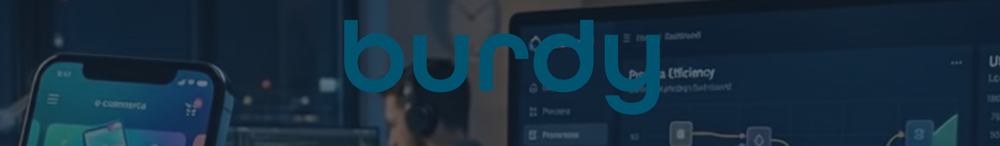

<!-- Banner / logotyp -->

  

<h1 align="center">Burdy</h1>

  <strong>Vi bygger digitala produkter som faktiskt levererar värde.</strong> 
  <em>We build digital products that actually deliver value.</em>

  <a href="https://burdy.se">🌐 Webbplats</a> ·
  <a href="mailto:modernworkplace@burdy.se">✉️ Kontakt</a> ·
  <a href="https://www.linkedin.com/company/burdysolutions">💼 LinkedIn</a>

  <a href="#svenska">🇸🇪 Svenska</a> · <a href="#english">🇬🇧 English</a>

---

## Svenska

### Om oss

Burdy är en digital konsultbyrå baserad i Stockholm som hjälper företag att bygga moderna webb- och mjukvarulösningar. Vi jobbar nära våra kunder från idé till lansering — och vidare. Vårt team kombinerar erfarenhet från startups, scale-ups och etablerade bolag.

### Vad vi gör

- **Webb- och apputveckling** – Skräddarsydda lösningar i moderna ramverk
- **Produktstrategi & UX** – Från användarintervjuer till färdig design
- **Cloud & DevOps** – Skalbar infrastruktur som växer med er
- **AI-integration** – Praktiska AI-lösningar som tillför verkligt värde
- **Teknisk rådgivning** – Arkitektur, kodgranskningar och teamcoaching

### Tekniker vi älskar

TypeScript · React · Next.js · Dotnet · Python · PostgreSQL · GCP · Azure · Docker

### Våra projekt

Här på GitHub hittar du några av våra öppna projekt, verktyg och bibliotek. Pinnade repon nedan är en bra startpunkt.

### Kontakta oss

Har ni en idé, ett projekt eller bara en fråga? Hör gärna av er.

📧 **[modernworkplace@burdy.se](mailto:modernworkplace@burdy.se)** · 🌐 **[burdy.se](https://burdy.se)**

---

## English

### About us

Burdy is a digital consultancy based in Stockholm, helping companies build modern web and software solutions. We work closely with our clients from idea to launch — and beyond. Our team combines experience from startups, scale-ups, and established companies.

### What we do

- **Web & app development** – Tailored solutions in modern frameworks
- **Product strategy & UX** – From user interviews to finished design
- **Cloud & DevOps** – Scalable infrastructure that grows with you
- **AI integration** – Practical AI solutions that add real value
- **Technical advisory** – Architecture, code reviews, and team coaching

### Tech we love

TypeScript · React · Next.js · Dotnet · Python · PostgreSQL · GCP · Azure · Docker

### Our projects

Here on GitHub you'll find some of our open projects, tools, and libraries. The pinned repos below are a good starting point.

### Get in touch

Got an idea, a project, or just a question? We'd love to hear from you.

📧 **[modernworkplace@burdy.se](mailto:modernworkplace@burdy.se)** · 🌐 **[burdy.se](https://burdy.se)**

---

  Made with ☕ in Stockholm

